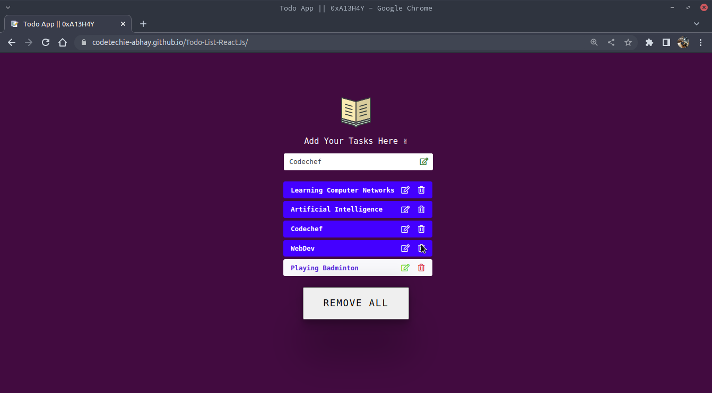

# TODO WebApp 📝
- This is a todo app to manage your daily tasks.
- Functionalities of the app:
    - Add tasks
    - Delete Tasks
    - Update the tasks
    
- It is built in React.js
***

## Screenshot:


***
## Run app on your local machine:
- Clone the repository 
    ```
    git clone https://github.com/codetechie-abhay/Todo-List-ReactJs.git
    ```
- Open the project in your favorite editor 
    ```
    cd Todo-List-ReactJs/ 
    ```
- Install the dependencies
    ```
    npm i
     ```
- Run the project in your local machine
    ```
    npm start
    ```
***
<br />

To view a live example, **[click here](https://codetechie-abhay.github.io/Todo-List-ReactJs/)**.

<br/>
Do fork and star ⭐ the repo if you find it appreciable. For any queries and suggestions, Conatct me at my mailing address.
